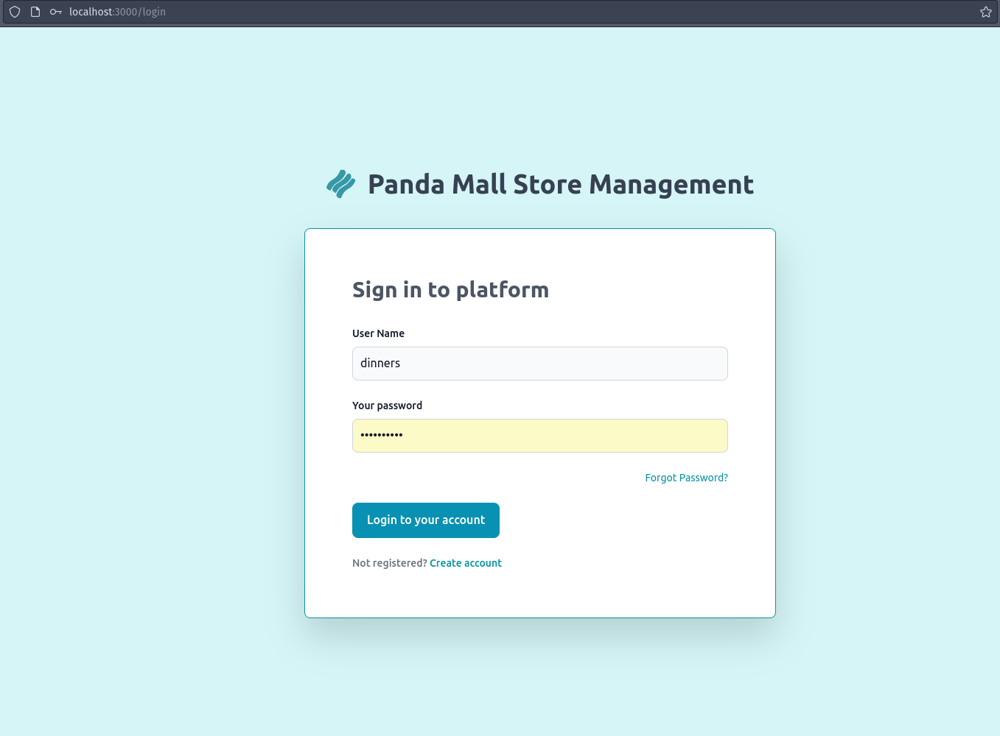
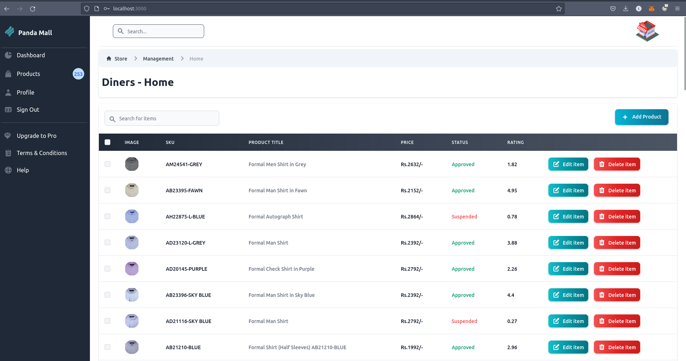
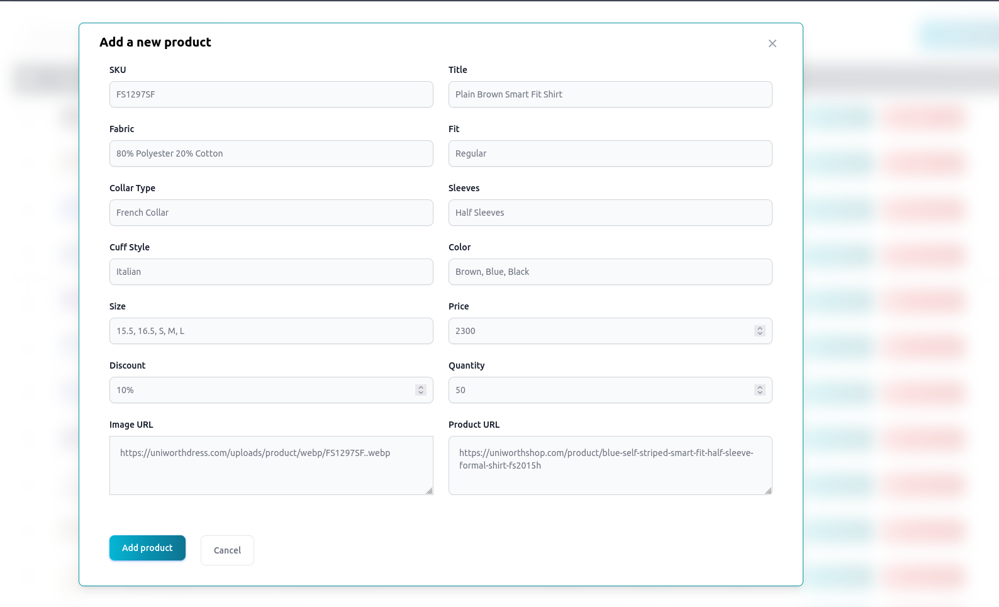
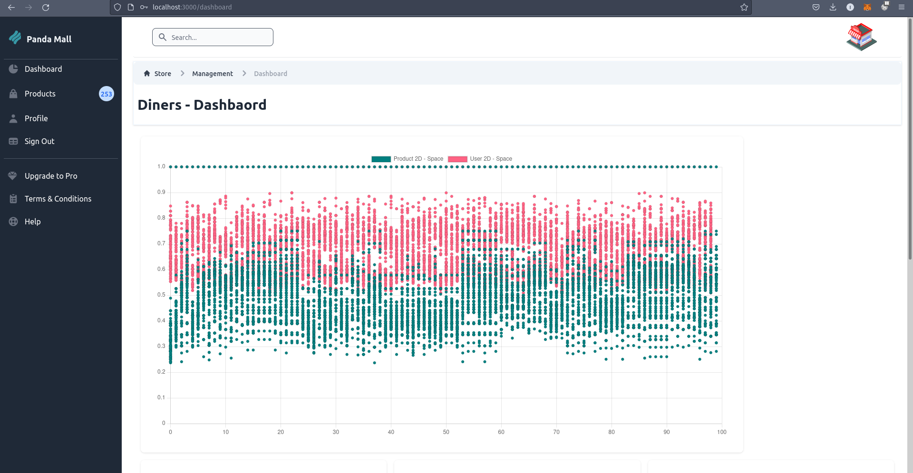
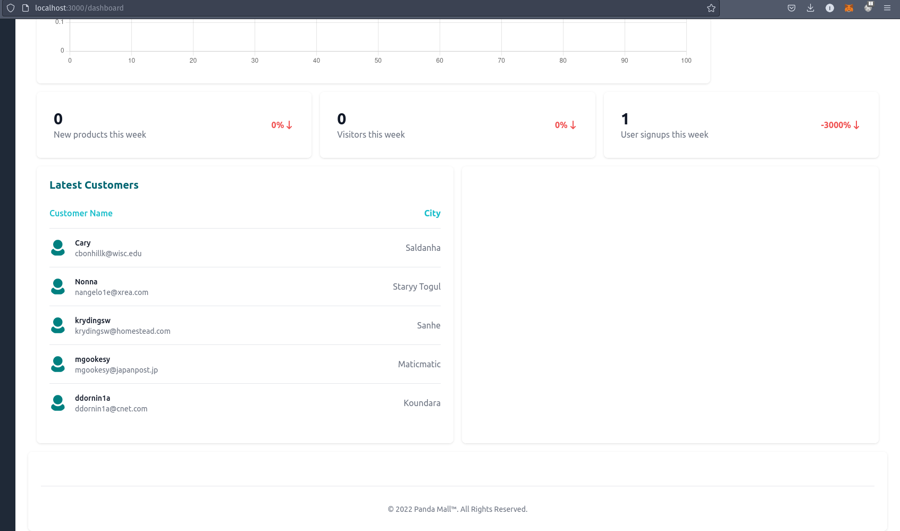
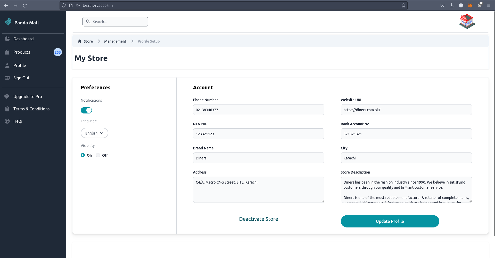

# Panda Mall
## A Web based Recommendation System for Fashion Products.

[](https://github.com/AsjadIftikhar/Panda-Mall.git)

The Websites personalize the recommendation of fashion products based on customer preferences, history and improves results over time.
It allows Brands to register their stores and add, delete, update products to be recommended to customers and guage the performance of the brand using the dashboard.
It lets admins suspend products in case of policy Violation
 
It is an Final Year Project with following contributors:
- Asjad Iftikhar
- Tayyab Waseem
- Muhammad Zain

## Features

A complete description of the entire project can be found in the following Document: 

- [Panda Mall Report](https://github.com/AsjadIftikhar/Panda-Mall/blob/main/FYP-II/D4/Panda%20Mall_Updated%20Report.pdf)

## Screenshots of Store Side:

### Login Page



### Home Page CRUD





### Dashboard




### Profile Page



## Installation

Panda Mall use Python Django for Backend adnd Create React App for Frontend Development

For Backend

Clone Code in a directory
setup a python 3.9 pipenv interpreter

```sh
pipenv install
python manage.py makemigrations
python manage.py migrate
python manage.py runserver
```

Frontend
Clone Code in a separate directory
Requires Node v14+, NPM

```sh
npm install
npm run dev

```


